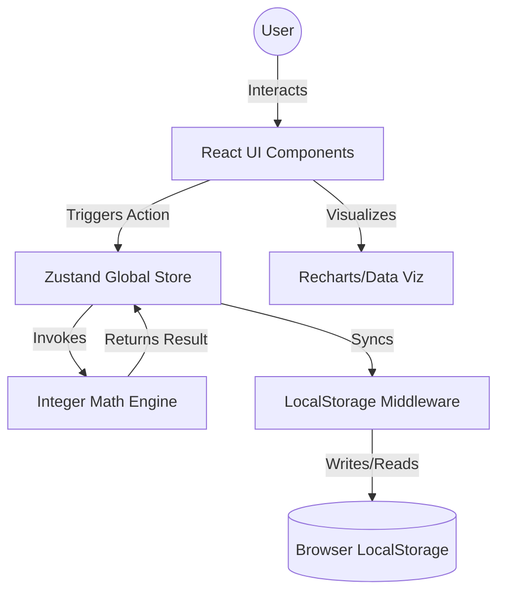

# 2. High-Level Architecture

## 2.1 Technical Summary
Yash-Finance is built as a **Single Page Application (SPA)** using a **Client-Side Monolith** pattern. It eliminates server latency by performing all calculations and data persistence directly in the browser. 

## 2.2 Architectural Style: Monorepo
We use a monorepo structure to maintain a clean separation of concerns:
*   **apps/web**: The React/Tailwind frontend application.
*   **packages/core**: Pure TypeScript logic for the Integer Math Engine and state validators.

## 2.3 System Diagram

---
