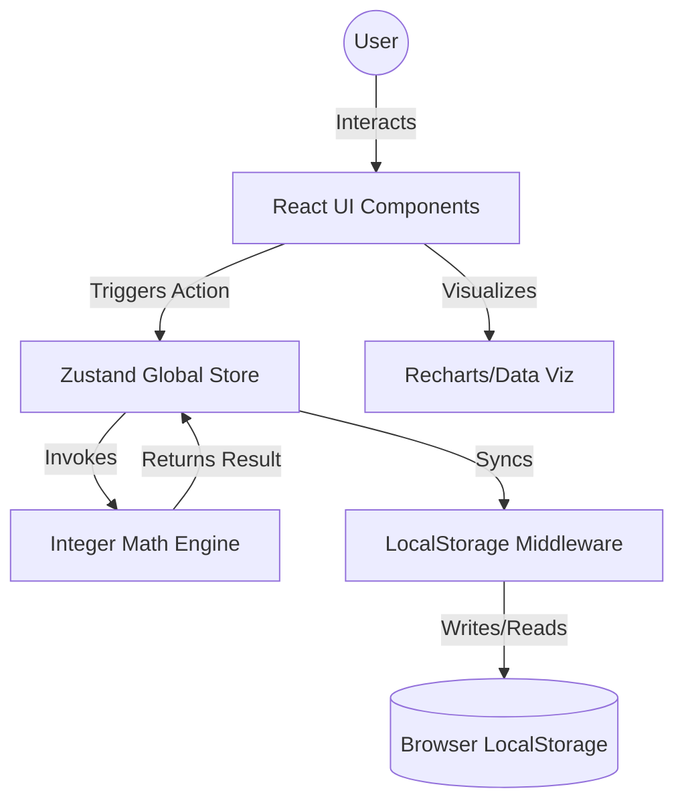

# Yash-Finance Architecture Document

**Date:** October 26, 2023  
**Version:** 1.0  
**Status:** Definitive Blueprint  
**Author:** Winston (Architect) 🏗️

---

## 1. Introduction
This document outlines the technical architecture for **Yash-Finance**. It establishes a client-side "local-first" monolith using a monorepo structure to separate core financial logic from UI components. The architecture is optimized for high-performance Reactivity and mathematical precision.

### 1.1 Change Log
| Date | Version | Description | Author |
| :--- | :--- | :--- | :--- |
| 2023-10-26 | 1.0 | Initial fullstack architecture for local-first dashboard | Winston |

---

## 2. High-Level Architecture

### 2.1 Technical Summary
Yash-Finance is built as a **Single Page Application (SPA)** using a **Client-Side Monolith** pattern. It eliminates server latency by performing all calculations and data persistence directly in the browser. 

### 2.2 Architectural Style: Monorepo
We use a monorepo structure to maintain a clean separation of concerns:
*   **apps/web**: The React/Tailwind frontend application.
*   **packages/core**: Pure TypeScript logic for the Integer Math Engine and state validators.

### 2.3 System Diagram


---

## 3. Tech Stack

| Category | Technology | Version | Purpose |
| :--- | :--- | :--- | :--- |
| **Framework** | React (Vite) | 18.x | UI Library and build tool for fast HMR. |
| **Language** | TypeScript | 5.x | Ensuring type safety for financial entities. |
| **Styling** | Tailwind CSS | 3.x | Implementing the 8px grid and custom palette. |
| **State Mgmt** | Zustand | 4.x | Lightweight, reactive store for global state. |
| **Persistence** | LocalStorage | Native | "Local-first" data sovereignty. |
| **Math** | Decimal.js / Custom | N/A | Integer-based math utilities (storing cents). |
| **Charts** | Recharts | 2.x | Responsive SVG-based data visualization. |
| **Icons** | Lucide-React | Latest | Minimalist, professional icon set. |

---

## 4. Data Models

### 4.1 Wallet Entity
```typescript
interface Wallet {
  id: string;          // UUID
  name: string;        // e.g., "Main Savings"
  balance: number;     // Integer (cents)
  color: string;       // Hex code for card accent
  createdAt: string;   // ISO Date
}
```

### 4.2 Transaction Entity
```typescript
type TransactionType = 'income' | 'expense' | 'subscription' | 'purchase';

interface Transaction {
  id: string;
  title: string;
  amount: number;      // Integer (cents)
  type: TransactionType;
  category: string;
  walletId: string;    // Reference to Wallet.id
  date: string;        // ISO Date
}
```

---

## 5. The "Finance Engine" Logic

### 5.1 The Integer Rule
To prevent floating-point errors, all currency is handled as **cents**:
*   **Input:** User types `10.50` -> Utility converts to `1050`.
*   **Storage:** `1050` is stored in the Transaction object.
*   **Calculation:** `balance = sum(incomes) - sum(expenses)`.
*   **Display:** `(1050 / 100).toFixed(2)` -> Result `$10.50`.

### 5.2 LocalStorage Schema
```json
{
  "version": 1,
  "state": {
    "wallets": [],
    "transactions": [],
    "settings": { "currency": "USD" }
  }
}
```

---

## 6. UI & Component Architecture

### 6.1 Design Tokens (Tailwind Config)
*   **Spacing:** `8px` base. `1 = 4px`, `2 = 8px`, `4 = 16px`, `6 = 24px`, `8 = 32px`.
*   **Radius:** `rounded-xl` (12px).
*   **Theme:**
    *   `bg-main`: `#0F1117`
    *   `bg-surface`: `#161A23`
    *   `border-subtle`: `#232634`
    *   `brand-indigo`: `#6366F1`

### 6.2 Component Hierarchy
*   **Sidebar (240px):** Fixed left navigation.
*   **Navbar (64px):** Page title and "Add Transaction" CTA.
*   **StatsGrid:** 4-column CSS Grid (Total Balance, Income, Expense, Net Change).
*   **ChartSection:** 2-column flexbox for Trend and Category charts.
*   **TransactionList:** Filterable table using the `#161A23` card surface.

---

## 7. Source Tree Structure

```text
yash-finance/
├── apps/
│   └── web/
│       ├── src/
│       │   ├── components/     # UI (Sidebar, Navbar, Cards)
│       │   ├── features/       # Logic (WalletCRUD, TransactionCRUD)
│       │   ├── store/          # Zustand slices
│       │   ├── hooks/          # useLocalStorage, useFinance
│       │   ├── utils/          # formatCurrency, mathEngine
│       │   └── assets/         # Global styles & Fonts
│       └── tailwind.config.js
├── packages/
│   └── shared/                 # Common Types & Constants
├── docs/
│   ├── prd.md
│   └── architecture.md
└── package.json
```

---

## 8. Coding Standards for AI Agents
1.  **Strict Typing:** No `any` types. All financial amounts must use the `CentAmount` type alias (number).
2.  **Tailwind Strictness:** Do not use arbitrary values like `p-[23px]`. Use standard scales or custom defined tokens.
3.  **Component Size:** Break complex modals into sub-components (e.g., `TransactionForm`, `WalletSelect`).
4.  **Immutability:** Always use spread operators or `immer` when updating the Zustand store.

---

## 9. Next Steps
1.  **Shard for Development:** Break this and the PRD into task shards.
2.  **Scaffolding (Epic 1):** Initialize the Monorepo and Tailwind theme.

***
