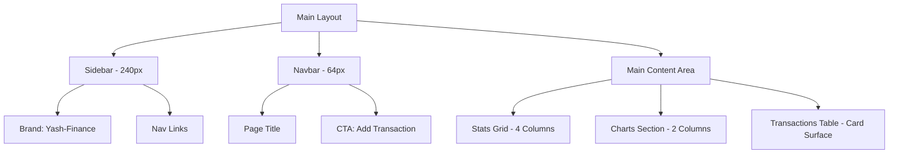

# Yash-Finance UI/UX Specification

**Date:** October 26, 2023  
**Version:** 1.0  
**Status:** Design Finalized  
**Author:** Sally (UX Expert) 🎨

---

## 1. Introduction
This document defines the user experience goals, information architecture, and visual design specifications for **Yash-Finance**. It serves as the primary reference for frontend development to ensure a cohesive, professional, and "calm" financial interface.

### 1.1 UX Goals & Principles
*   **Structural Calm:** Use of the 8px grid and deep graphite tones to reduce cognitive load and financial anxiety.
*   **Precision Visibility:** High-contrast typography and specific semantic colors (Indigo/Green/Red) to make data instantly readable.
*   **Contextual Focus:** Use of modals for CRUD actions to keep the user anchored to the dashboard view.

---

## 2. Information Architecture
### 2.1 Navigation Structure
*   **Primary Navigation (Sidebar):** Dashboard (Home), Transactions, Wallets, Settings.
*   **Quick Actions (Navbar):** "Add Transaction" (Primary CTA).

### 2.2 Site Map

---

## 3. Design Tokens & Visual System

### 3.1 Color Palette
| Token | Hex Code | Usage |
| :--- | :--- | :--- |
| **Background** | `#0F1117` | Full app background |
| **Surface** | `#161A23` | Sidebar, Cards, Modals, Table Containers |
| **Border** | `#232634` | Subtle separators, Card borders |
| **Primary/Indigo** | `#6366F1` | Active indicators, Primary buttons, Accents |
| **Success/Green** | `#10B981` | Income values, "Positive" chart segments |
| **Danger/Red** | `#EF4444` | Expense values, "Negative" chart segments |
| **Text Primary** | `#F9FAFB` | Headings, Main values, Active text |
| **Text Muted** | `#9CA3AF` | Labels, Inactive nav, Metadata |

### 3.2 Typography
*   **Primary Font:** Inter (Body/UI)
*   **Secondary Font:** Space Grotesk (Brand/Headers)

| Level | Size | Weight | Color | Usage |
| :--- | :--- | :--- | :--- | :--- |
| **Display** | 28px | 700 | `#F9FAFB` | Stats Card Values |
| **H1** | 24px | 600 | `#F9FAFB` | Navbar Page Titles |
| **Brand** | 18px | 600 | `#F9FAFB` | Sidebar Logo |
| **H2** | 16px | 600 | `#F9FAFB` | Chart/Section Titles |
| **Body** | 14px | 500 | `#F9FAFB` | Table Content, Nav Items |
| **Small** | 12px | 400 | `#9CA3AF` | Labels, Table Headers |

### 3.3 Spacing & Rhythm (8px Law)
*   **Base:** 8px
*   **Standard Padding:** 24px (Cards, Modals)
*   **Gaps:** 16px (Small items), 24px (Grid gutters), 32px (Section margins)
*   **Radius:** 12px (`rounded-xl`) for all containers.

---

## 4. Component Specifications

### 4.1 Sidebar (Fixed)
*   **Width:** 240px.
*   **Surface:** `#161A23` with 1px Right Border `#232634`.
*   **Brand:** Top-aligned, 24px padding.
*   **Items:** Vertical list, 8px gap between items. Inactive: `#9CA3AF`. Active: Text `#F9FAFB` + Left 3px Indigo border.

### 4.2 Stats Cards (Grid)
*   **Layout:** 4-column grid, 24px gap.
*   **Surface:** `#161A23`, 12px radius, 20px padding.
*   **Content:** Top label (14px Muted), Bottom value (28px Bold).

### 4.3 Data Visualization (Charts)
*   **Containers:** Height 300px, styled as Card surfaces.
*   **Colors:** Use semantic Green/Red/Indigo.
*   **Axis:** Muted Gray (`#9CA3AF`), 12px font size.

### 4.4 Transactions Table
*   **Header:** Height 40px, Background `#161A23` (darker variant or same).
*   **Rows:** 1px bottom border `#232634`. Hover state: Background `#232634`.
*   **Columns:** Title (Left), Amount (Right), Category (Badge), Wallet (Pill), Date (Center), Actions (Right).

### 4.5 CRUD Modals
*   **Overlay:** 60% opacity `#0F1117`.
*   **Surface:** `#161A23`, 12px radius, centered.
*   **Inputs:** Border `#232634`, Background `#0F1117`. Focus state: Border Indigo `#6366F1`.

---

## 5. Responsiveness & Adaptation
*   **Desktop (>1024px):** Fixed sidebar, full 4-column grid.
*   **Tablet (768px - 1024px):** 2-column grid for Stats; sidebar remains or becomes icons.
*   **Mobile (<768px):** 
    *   Sidebar collapses to Hamburger menu.
    *   Navbar title center-aligned.
    *   Stats cards stack 1-per-row.
    *   Table becomes scrollable horizontally or "Card-view" items.

---

## 6. Animation & Interaction
*   **Transitions:** 200ms `ease-in-out` for hover states and mobile menu slides.
*   **Modals:** Subtle "Scale Up" (95% -> 100%) and "Fade In" on entry.
*   **Numbers:** (Optional) Count-up animation for balance changes to highlight "Instant" calculation.

---

## 7. Change Log
| Date | Version | Description | Author |
| :--- | :--- | :--- | :--- |
| 2023-10-26 | 1.0 | Initial design spec for Yash-Finance | Sally |

***

